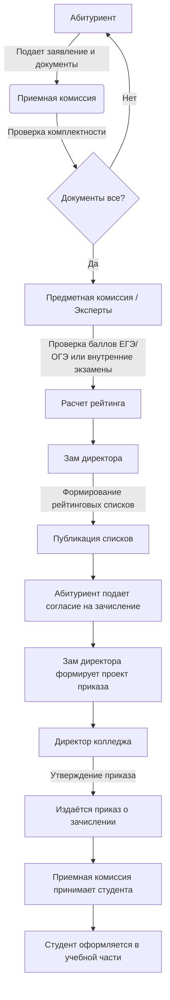

```mermaid
graph TD
    A[Абитуриент] -->|Подает заявление и документы| B(Приемная комиссия)
    B -->|Проверка комплектности| C{Документы все?}
    C -- Нет --> A
    C -- Да --> D[Предметная комиссия / Эксперты]
    D -->|Проверка баллов ЕГЭ/ОГЭ или внутренние экзамены| E[Расчет рейтинга]
    E --> F[Зам директора]
    F -->|Формирование рейтинговых списков| G[Публикация списков]
    G --> H[Абитуриент подает согласие на зачисление]
    H --> I[Зам директора формирует проект приказа]
    I --> J[Директор колледжа]
    J -->|Утверждение приказа| K[Издаётся приказ о зачислении]
    K --> L[Приемная комиссия принимает студента]
    L --> M[Студент оформляется в учебной части]
```
